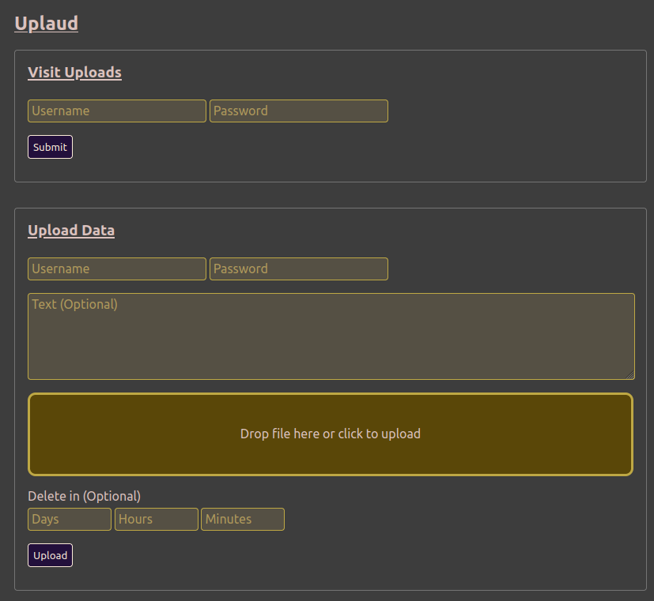

# Uplaud

`Uplaud` (portmanteau of Upload and Applaud) is a service you can run to upload text and files to. It was made because I've explored many public file shares and none of them provide a quick, simple way to visit the files you've just uploaded on another device. You either need to sign in to an account with a mandatory email and long, complex password, or you need to remember an unituitive token like Fje3dBv. `Uplaud` solves this. It asks for a username and password, merely 1+ characters in length, to hide your ephemeral uploaded data. Also, despite a passwords' potential to be meaningless here, they are still encrypted with scrypt in case you want them to be meaningful.

## Preview

Right now, it looks like this.



## Set Up

Rename `rename_to_configs.py` to `configs.py` and set the variables inside that file.

Consider changing route limits. Look for both routed wrapped in `@limiter.limit`.

Install Redis for rate limiting.

```
sudo apt update
sudo apt install redis-server
sudo nano /etc/redis/redis.conf # set line `supervised no` to `supervised systemd`
sudo systemctl restart redis
sudo systemctl status redis
```

Change `redis://localhost:6379` if needed.

To delete the expired records, set up a cronjob with `sudo crontab -e`.

```
*/5 * * * * /path/uplaud/venv/bin/python3 /path/uplaud/garbage_truck.py >> ~/cronout.txt 2>&1
```

